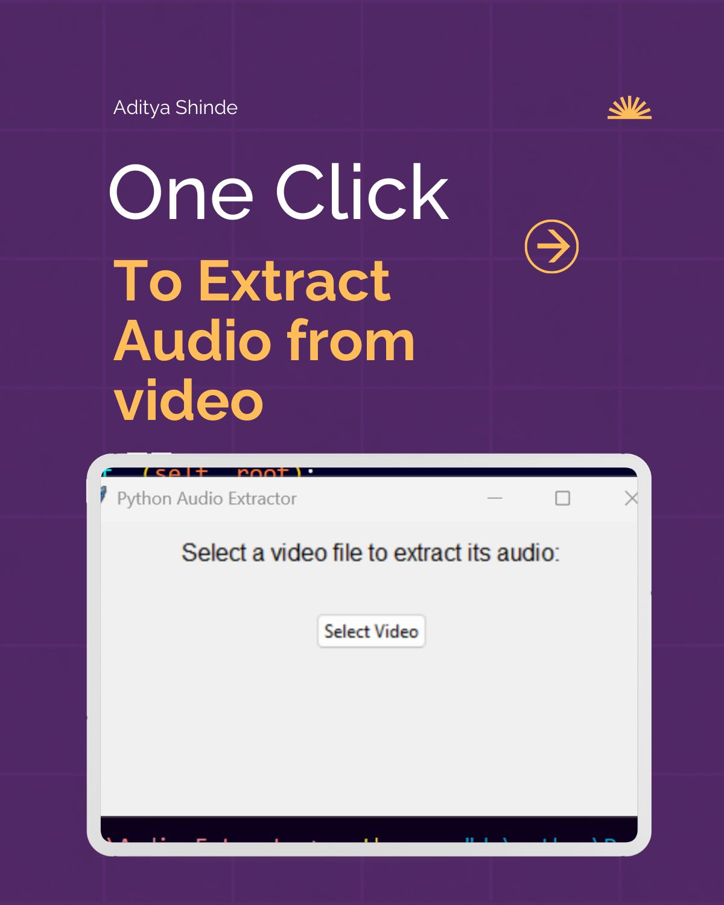
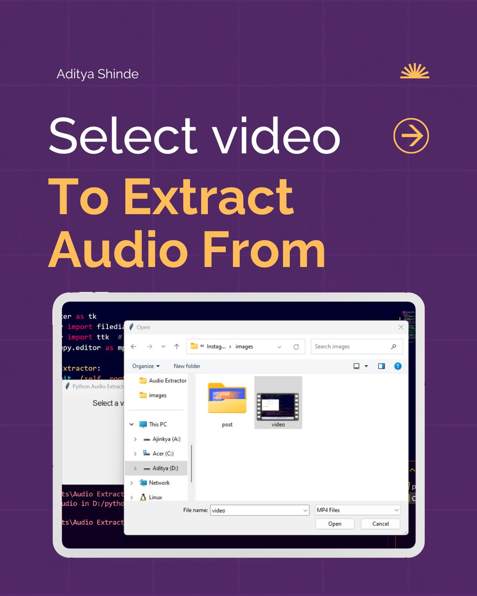

# 🎵 Python Audio Extractor


 

 


**Python Audio Extractor** is a simple and user-friendly application that allows you to extract audio from video files. The application is built using Python's `tkinter` library for the GUI and `moviepy` for handling video and audio processing.

## 🛠️ Features

- **Easy-to-use GUI**: The application features a simple graphical user interface (GUI) built with `tkinter`.
- **Support for Multiple Video Formats**: Extract audio from various video formats like MP4, AVI, and more.
- **Output as MP3**: Extracted audio is saved in MP3 format for compatibility with most devices.

## 🚀 How to Use

1. **Clone the Repository**
   ```bash
   git clone https://github.com/AdityaManojShinde/Audio-Extractor.git
   cd Audio-Extractor

2. **Install Required Libraries **
    Ensure you have Python installed, then install the necessary packages:
   ```bash
   pip install moviepy

3. **Run the Application Start the application by running the following command: **
   
   ```bash
   python main.py


## 🙌 Contributing

Contributions are what make the open-source community such an amazing place to learn, inspire, and create. Any contributions you make are **greatly appreciated**.

## Author
Aditya Shinde

  